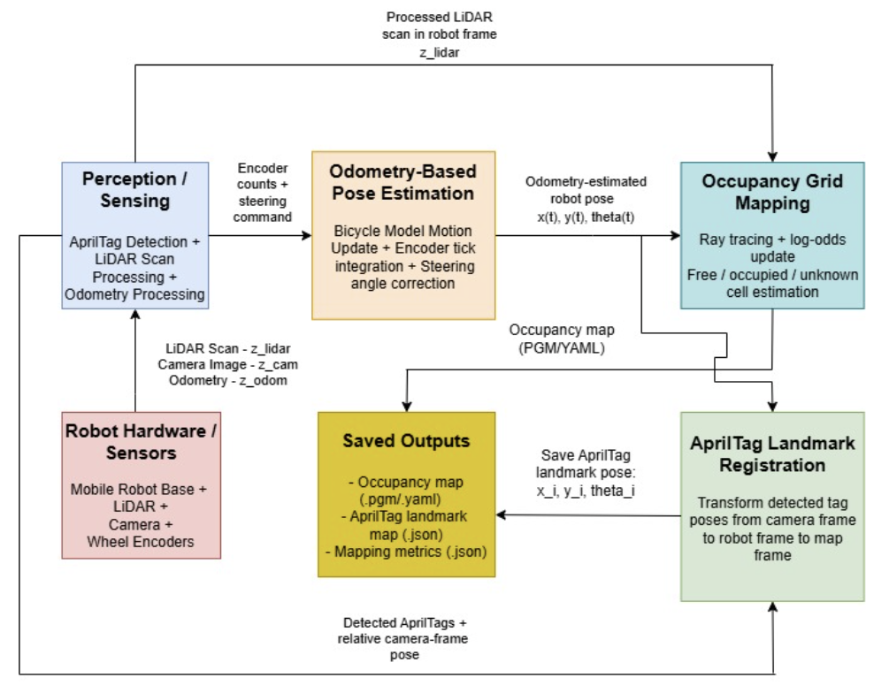
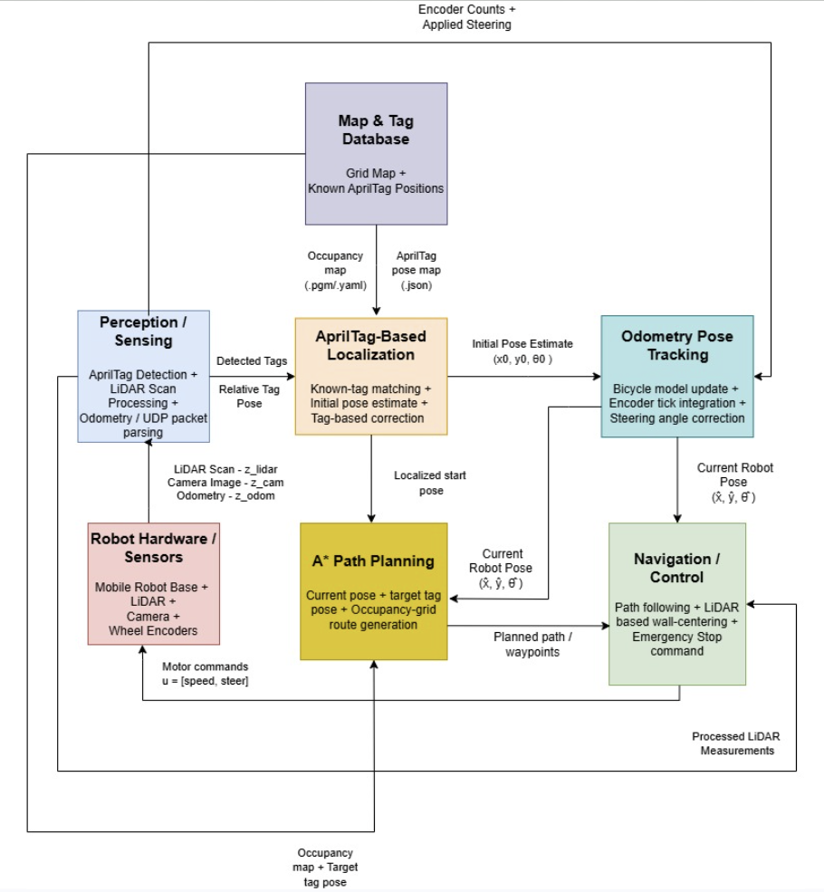
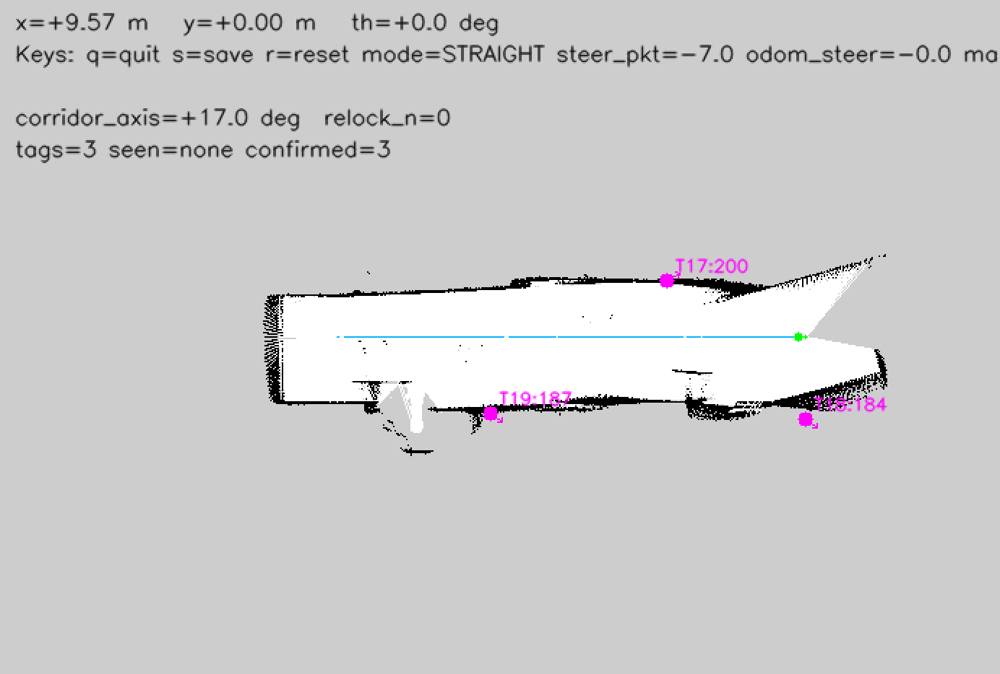
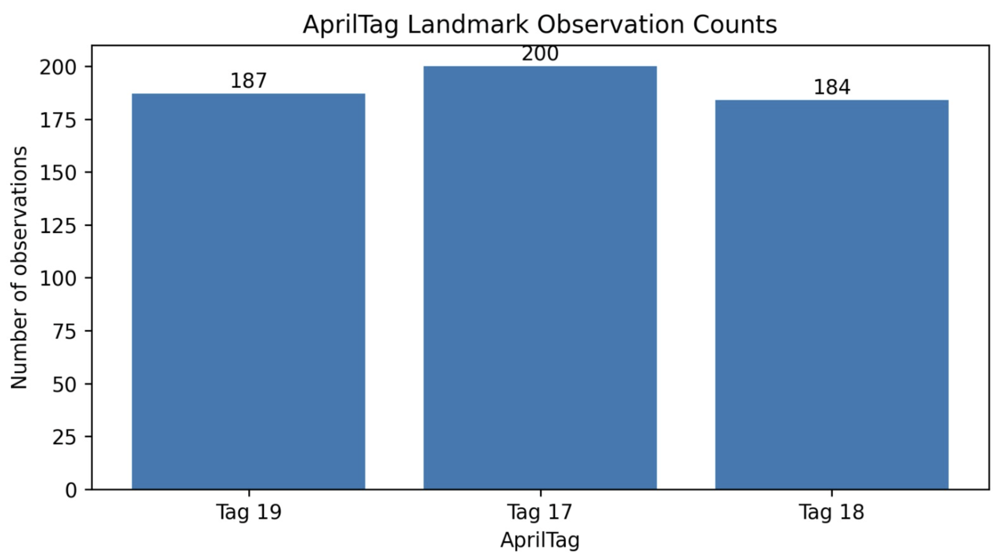
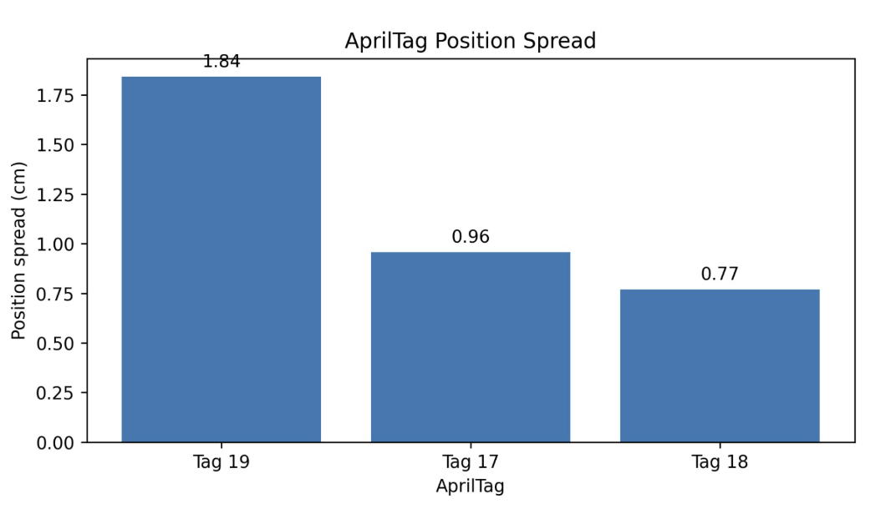
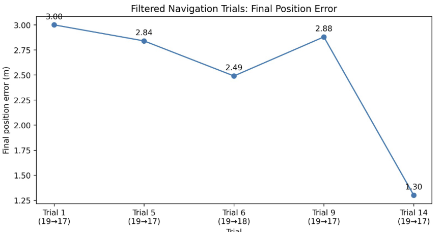
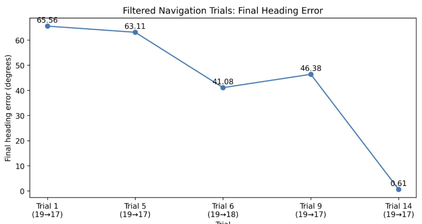
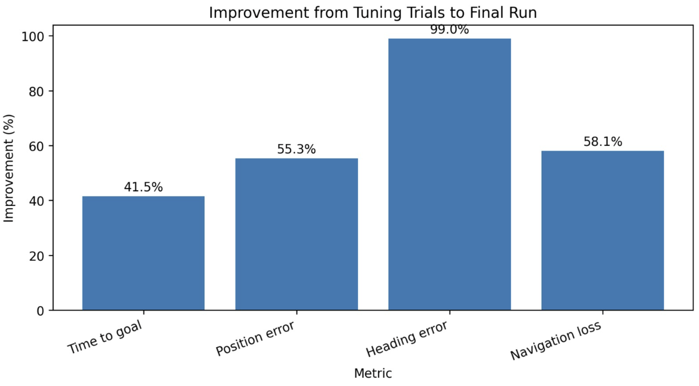
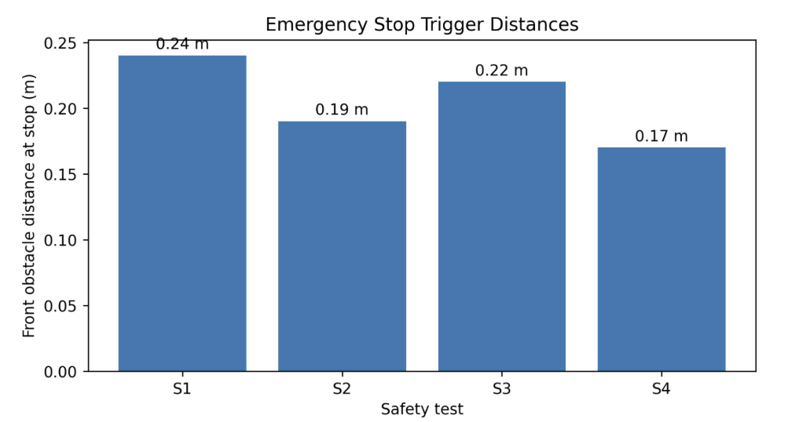

# Autonomous Indoor Navigation Using LiDAR Mapping and AprilTag Landmarks

This repository contains a full hardware–software pipeline for autonomous indoor navigation on a small mobile robot. The system builds a 2D occupancy grid map from LiDAR and wheel odometry, registers AprilTags as map landmarks, then uses the saved map and landmark database to navigate toward a selected AprilTag goal with LiDAR-based wall centering and front-obstacle emergency stopping.

In the final navigation demonstration, we selected **Tag 17** as the goal landmark. The robot reached the correct physical AprilTag goal in **29.97 s**, with **0 collisions**, a logged final heading error of **0.61°**, and a final position error of **1.30 m**. The remaining logged position error mainly reflects odometry/map-frame drift rather than the robot stopping at the wrong target.

---

## Repository structure

```text
.
├── arduino/
│   ├── robot_arduino_code.ino
│   ├── RPLidar.cpp / RPLidar.h
│   └── RPLidar protocol headers
│
├── python/
│   ├── apriltag_detection.py
│   ├── camera_calibration.py
│   ├── parameters.py
│   ├── robot_gui.py
│   ├── tag_navigation.py
│   └── udp_occupancy_mapper.py
│
├── outputs/
│   ├── mapping/
│   │   ├── final_apriltag_landmarks.json
│   │   ├── final_mapping_metrics.json
│   │   ├── final_occupancy_grid_preview.png
│   │   ├── final_occupancy_grid.pgm
│   │   └── final_occupancy_grid.yaml
│   │
│   └── navigation/
│       ├── successful_navigation_run_tag17.json
│       └── emergency_stop_front.json
│
├── figures/
│   └── README figures and plots
│
└── requirements.txt
```

---

## System overview

The project has two main phases:

1. **Mapping phase:** The robot is manually driven through the environment. The laptop receives LiDAR, encoder, and steering data from the Arduino over UDP. The mapper integrates LiDAR rays using log-odds occupancy-grid mapping and records AprilTag landmark positions in the same map frame.

2. **Navigation phase:** The robot loads the saved occupancy map and AprilTag landmark file. It localizes from a known AprilTag, plans a route to the target tag using A*, follows the path using encoder odometry, and uses LiDAR for corridor centering and front safety.





---

## Coordinate frames

AprilTag pose estimation uses OpenCV camera coordinates, where camera **z** points forward and camera **x** points right. The system converts this into the robot frame, where robot **x** points forward and robot **y** points left. The robot-frame tag observation is then transformed into the map frame using the current odometry-estimated robot pose.


---

## Hardware used

- Mobile robot base with differential motor control and steering servo
- RPLidar sensor
- Wheel encoder
- Camera / phone camera for AprilTag detection
- Arduino-compatible controller with Wi-Fi UDP communication
- Laptop running the Python mapping, GUI, and navigation scripts

---

## Software components

### Arduino firmware

`arduino/robot_arduino_code.ino`

The Arduino code handles the low-level robot behavior:

- Connects to the robot Wi-Fi network.
- Receives speed, steering, and auto-corridor commands over UDP.
- Reads encoder ticks and LiDAR scan data.
- Sends binary LiDAR/odometry packets to the laptop.
- Applies motor commands and servo steering.
- Runs a LiDAR side-wall centering controller.
- Triggers front safety stopping when an obstacle is too close.
- Stops the robot automatically if UDP commands are lost.

### Python mapping

`python/udp_occupancy_mapper.py`

The mapper:

- Receives binary UDP packets from the Arduino.
- Converts encoder ticks and steering commands into odometry.
- Converts LiDAR scan bins into robot-frame rays.
- Updates a 2D log-odds occupancy grid.
- Detects AprilTags and saves their map-frame landmark positions.
- Saves the final map as `.pgm`, `.yaml`, preview `.png`, tag `.json`, and metrics `.json`.

### Python navigation

`python/tag_navigation.py`

The navigation script:

- Loads the saved occupancy grid map and AprilTag landmark JSON.
- Localizes the robot from a known AprilTag.
- Plans a route to the target tag using A*.
- Drives using odometry-based pose tracking.
- Uses LiDAR front safety to stop before obstacles.
- Uses LiDAR side-wall centering in straight-drive mode.
- Saves navigation metrics after each run.

### GUI

`python/robot_gui.py`

The NiceGUI interface provides:

- Manual speed and steering control.
- Auto-corridor centering toggle.
- Emergency stop button.
- AprilTag navigation launch controls.
- Live AprilTag landmark status from the mapper.

---

## Installation

Create a Python environment and install the dependencies:

```bash
python -m venv .venv
source .venv/bin/activate      # macOS/Linux
# .venv\Scripts\activate       # Windows

pip install -r requirements.txt
```

The main Python dependencies are OpenCV, NumPy, Matplotlib, NiceGUI, and FastAPI.

---

## Configuration

Before running on hardware, update the network settings in:

```text
python/parameters.py
arduino/robot_arduino_code.ino
```

Set:

```text
Laptop IP
Arduino IP
Wi-Fi SSID
Wi-Fi password
UDP port
Camera index
```

The shared UDP port used in this project is:

```text
4010
```

The final submitted code replaces private Wi-Fi credentials and IP addresses with placeholders.

---

## Running the system

### 1. Upload Arduino firmware

Open `arduino/robot_arduino_code.ino` in the Arduino IDE, install the required Wi-Fi and RPLidar libraries, update the Wi-Fi/IP placeholders, and upload the sketch to the robot controller.

### 2. Build a map

From the repository root:

```bash
python python/udp_occupancy_mapper.py --tags --camera-index 1
```

Drive the robot manually using the GUI or a UDP command sender. Press **s** in the OpenCV map window to save the map and AprilTag landmarks.

The final saved mapping outputs are in:

```text
outputs/mapping/
```

### 3. Run the teleoperation GUI

```bash
python python/robot_gui.py
```

Use the GUI for manual driving, emergency stop testing, and launching AprilTag navigation.

### 4. Navigate to an AprilTag goal

Example final run command:

```bash
python python/tag_navigation.py \
  --target-tag 17 \
  --map-yaml outputs/mapping/final_occupancy_grid.yaml \
  --tag-map outputs/mapping/final_apriltag_landmarks.json \
  --camera-index 1 \
  --straight-drive
```

The navigation script first waits for AprilTag localization. After the pose is initialized, switch the laptop back to the robot Wi-Fi if needed and press **G** in the OpenCV window to start driving.

---

## Mapping outputs

The final mapping folder contains:

| File | Purpose |
|---|---|
| `final_occupancy_grid_preview.png` | Human-readable preview of the final occupancy map |
| `final_occupancy_grid.pgm` | Machine-readable occupancy grid |
| `final_occupancy_grid.yaml` | Map metadata: resolution, origin, thresholds |
| `final_apriltag_landmarks.json` | Saved AprilTag landmark database |
| `final_mapping_metrics.json` | Mapping metrics and tag observation statistics |

Final occupancy map preview:



Final map area breakdown:


---

## AprilTag landmark results

The final map registered **3 confirmed AprilTag landmarks**: Tag 19, Tag 17, and Tag 18. Each tag was observed many times, giving stable landmark estimates.

| Tag | Observations | Position spread |
|---|---:|---:|
| Tag 19 | 187 | 1.84 cm |
| Tag 17 | 200 | 0.96 cm |
| Tag 18 | 184 | 0.77 cm |





The mean AprilTag position spread was approximately **1.19 cm**, which shows that repeated visual landmark observations were consistent enough to support map-based navigation.

---

## Navigation results

The final successful run navigated to **Tag 17**:

| Metric | Value |
|---|---:|
| Target tag | 17 |
| Success | True |
| Time to goal | 29.97 s |
| Final logged position error | 1.30 m |
| Final logged heading error | 0.61° |
| Collision count | 0 |
| Navigation loss | 14.48 |

The final logged JSON result is stored in:

```text
outputs/navigation/successful_navigation_run_tag17.json
```

Position and heading errors over selected filtered navigation trials:





Important note: the first four selected tuning trials are not a perfectly controlled apples-to-apples comparison with the final run. Those earlier trials did **not** use the final LiDAR side-wall centering behavior, so the robot tended to drift toward one side of the wall even with proportional steering. That drift likely came from a mix of floor friction, steering trim, wheel imbalance, and encoder/odometry drift. The final run used the improved LiDAR-centering and safety behavior, so the improvement plot should be read as a tuning progression rather than a strict ablation study.



---

## Emergency stop behavior

The robot also demonstrated LiDAR-based front safety. In the emergency-stop tests, the front obstacle distance triggered stops between **0.17 m** and **0.24 m**, with no collisions during the safety demonstrations.

| Test | Front obstacle distance at stop |
|---|---:|
| S1 | 0.24 m |
| S2 | 0.19 m |
| S3 | 0.22 m |
| S4 | 0.17 m |



The representative emergency-stop output is stored in:

```text
outputs/navigation/emergency_stop_front.json
```

---

## Demonstration videos

Two demonstration videos can be included with the submission:

```text
outputs/videos/navigation.mp4
outputs/videos/emergency_stop.mp4
```

- `navigation.mp4` shows the robot navigating toward the selected AprilTag goal.
- `emergency_stop.mp4` shows the LiDAR front safety behavior stopping the robot before collision.

---

## Limitations and lessons learned

This system worked as an integrated end-to-end robot navigation pipeline, but several limitations remain:

- The final logged position error is affected by odometry drift and does not perfectly represent the physical stopping position.
- Early runs drifted toward one wall because the robot had steering trim, floor-friction, wheel-balance, and encoder/odometry bias.
- Camera feed stability depended on Wi-Fi/camera switching, so the system was designed to keep driving using the saved map and odometry if the camera became unavailable after initial localization.
- The final implementation does not rely on a particle filter. The submitted navigation pipeline uses AprilTag-based initialization, encoder odometry, A* planning, LiDAR centering, and LiDAR emergency stopping.
- The occupancy map is suitable for this corridor-scale demonstration, but a larger environment would require stronger localization, loop closure, or scan matching.

---

## Final summary

This project demonstrates a complete autonomous indoor navigation workflow: LiDAR-based occupancy-grid mapping, AprilTag landmark registration, saved-map navigation, A* route planning, odometry-based pose tracking, LiDAR wall centering, and emergency front-obstacle stopping. The final system successfully reached the correct AprilTag goal in under 30 seconds with zero collisions, while also demonstrating reliable emergency-stop behavior in separate safety tests.
